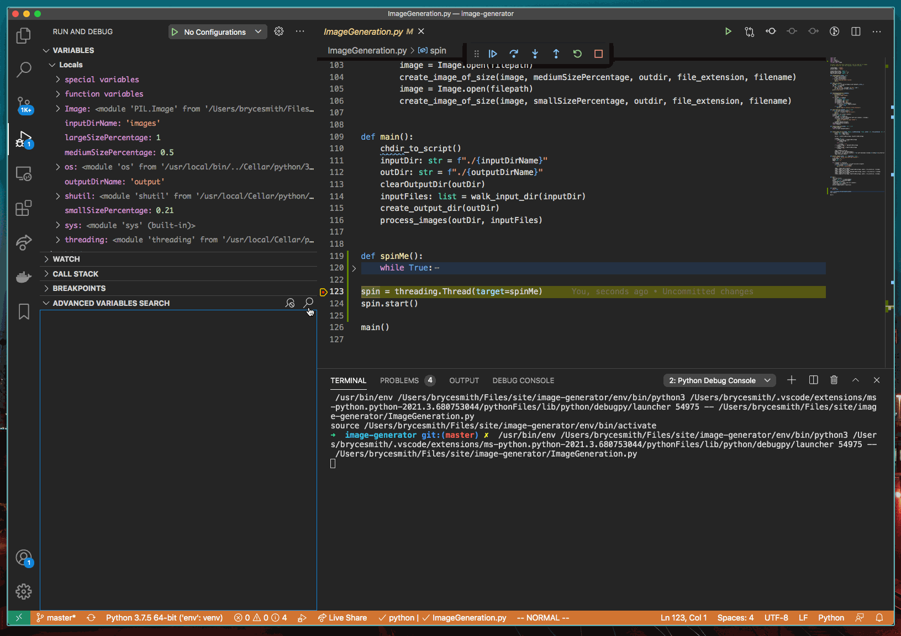

# Debugger Search

Search for values through the Visual Studio Code debugger.

This extension is avaliable in the [vscode Marketplace](https://marketplace.visualstudio.com/items?itemName=BryceSmith.debuggersearch). 

## Features

This extension adds nine new commands to Visual Studio Code:

- **variableSearch.search** - Search for a term while the debugger is paused. Filters by thread, stack frame and scope. Prints results to a special output channel,
and to a custom view under "Run and Debug."
- **variableSearch.setThread** - Choose the thread to search.
- **variableSearch.setFrame** - Choose the stack frame (relative to the selected thread) to search. 
- **variableSearch.setSearchDepth** - How deep should the search traverse? For example, a search depth of 2 would find `ExampleNamespace.ExampleMemberVar`, but not `ExampleNamespace.ExampleMemberVar.SecondExampleMemberVar`. Note that values above 3 may take some time. 
- **variableSearch.resetParameters** - Reset all search parameters, so they can be chosen again. For example, select a different scope or stack frame.
- **variableSearch.setScope** - Choose the scope you would like to search in. Example from Python: `Locals`, `Globals`
- **variableSearch.setSearchType** - Choose the type of search you would like to perform; options include either `contains`, `regex` or `exact match`.
- **variableSearch.searchForTermFromTree** - Search the debugger from the "Run and Debug" GUI screen  (vscode's debug view).
- **variableSearch.cancelSearch** - Cancel the search in progress; also available to trigger from the GUI.

## FAQ

- I can filter variables by typing in the `Variables` panel under "Run and Debug". How is this different?
  - **The filtering built into vscode does not automatically expand sub-objects. So only objects you have 'unfolded' would be included in your search results. For heavy searching, this is untenable; we need to request the information from the Debug Adapter**.

## Known Issues

- Occasionally, the "Debugger Search" output channel fails to populate until you select a different output channel (e.g, tasks) then go back. Results should still appear in the "Advanced Variables Search" panel when this happens. See [this github issue](https://github.com/microsoft/vscode/issues/90794).

### 0.8

Beta release..

## Contributing

- Pull requests are welcome. Please document issue reports with screenshots where possible.

